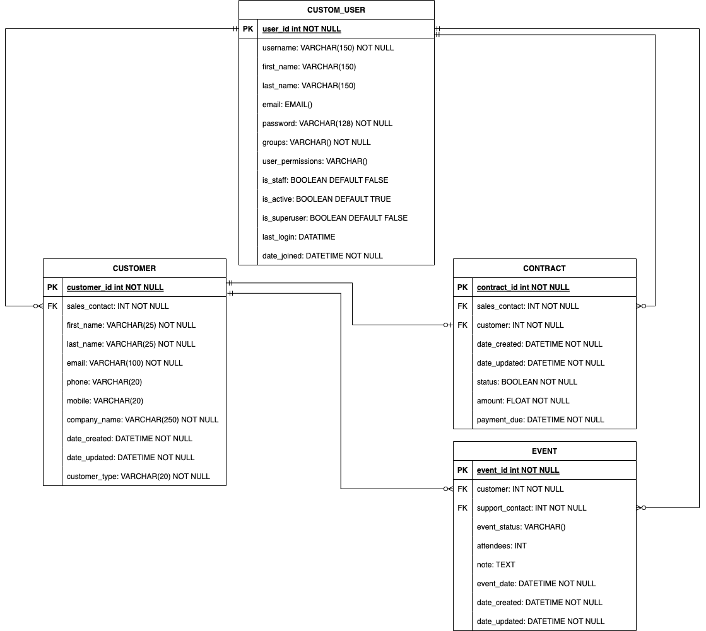
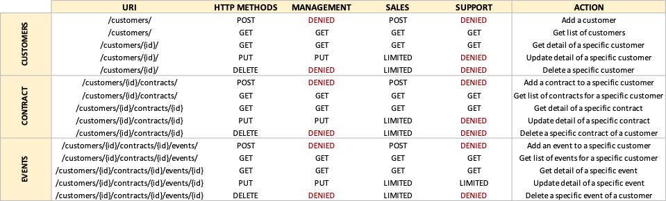
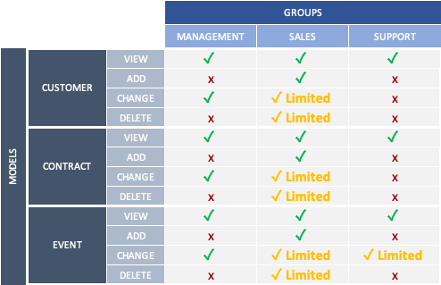

<div id="top"></div>

<!-- PROJECT SHIELDS -->
<!--
*** I'm using markdown "reference style" links for readability.
*** Reference links are enclosed in brackets [ ] instead of parentheses ( ).
*** See the bottom of this document for the declaration of the reference variables
*** for contributors-url, forks-url, etc. This is an optional, concise syntax you may use.
*** https://www.markdownguide.org/basic-syntax/#reference-style-links
-->
[![Contributors][contributors-shield]][contributors-url]
[![Forks][forks-shield]][forks-url]
[![Stargazers][stars-shield]][stars-url]
[![Issues][issues-shield]][issues-url]


<!-- PROJECT LOGO -->
<br />
<div align="center">

<h3 align="center">OC - PROJECT N°12 - CRM Platform using Django ORM Back-end </h3>

  <p align="center">
   Epic Events is a CRM App used internally to handle customers info, contracts and events.
    <br />
    <a href="https://github.com/Jliezed/oc_project_12_epicevents">View Demo</a>
    ·
    <a href="https://github.com/Jliezed/oc_project_12_epicevents/issues">Report Bug</a>
    ·
    <a href="https://github.com/Jliezed/oc_project_12_epicevents/issues">Request Feature</a>
  </p>
</div>


<!-- ABOUT THE PROJECT -->
## Project Overview


## Entity-Relationship Diagram


## Endpoints Summary


## Groups Permissions

#### Example
Customer Model for Change Action :
- Management group can change any customer information
- Sales group can change only customer information that has been assigned to them
- Support group can't change customer information


<p align="right">(<a href="#top">back to top</a>)</p>


## Built With

* Python 
* Django Rest Framework

<p align="right">(<a href="#top">back to top</a>)</p>


<!-- GETTING STARTED -->
## Getting Started

### Installation & Running the script

1. Clone the repo
   ```sh
   git clone https://github.com/Jliezed/oc_project_12_epicevents.git
   ```

### Create and activate a virtual environment
2. Install venv library (if not yet in your computer)
   ```sh
   pip install venv
   ```
3. Create a virtual environment
   ```sh
   python -m venv env
   ```
4. Activate the virtual environment
   ```sh
   source env/bin/activate
   ```
#### Install packages
6. Install the packages using requirements.txt
   ```sh
   pip install -r requirements.txt
   ```
#### Set environment variables
7. Create a copy of the file ".env.default" and rename it ".env"
8. Set value to the .env file:
   1. Define a secret key
   2. Debug to True for local development or False for production
   3. Allowed host equal to 127.0.0.1 for local environment

      ```sh
      SECRET_KEY='YOUR SECRET KEY'
      DEBUG=True
      ALLOWED_HOSTS=['127.0.0.1']
      ```
   4. Setup the database information
      ```sh
      DATABASE_NAME="YOUR_DATABASE_NAME"
      DATABASE_USER="YOUR_DATABASE_USER"
      DATABASE_PASSWORD="YOUR_DATABASE_PASSWORD"
      DATABASE_HOST="YOUR_DATABASE_HOST"
      DATABASE_PORT="5432"
      ```
      
#### Access to the App
9. Run the server
   ```sh
   python manage.py runserver
   ```
10. create a superuser
    ```sh
    python manage.py createsuperuser
    ```
11. Log to the API: http://127.0.0.1:8000/api/auth/login/
    ```sh
    User: your_username
    Password: your_password
    ```
### Access the different endpoints
- http://127.0.0.1:8000/api/customers/
- http://127.0.0.1:8000/api/customers/1
- http://127.0.0.1:8000/api/customers/1/contracts/
- http://127.0.0.1:8000/api/customers/1/contracts/
- http://127.0.0.1:8000/api/customers/1/contracts/1
- http://127.0.0.1:8000/api/customers/1/contracts/1/events/
- http://127.0.0.1:8000/api/customers/1/contracts/1/events/1
---


<p align="right">(<a href="#top">back to top</a>)</p>


<!-- CONTACT -->
## Contact

Jliezed

Project Link: [https://github.com/Jliezed/oc_project_12_epicevents.git](https://github.com/Jliezed/oc_project_10_softdesk.git)

<p align="right">(<a href="#top">back to top</a>)</p>


<!-- MARKDOWN LINKS & IMAGES -->
<!-- https://www.markdownguide.org/basic-syntax/#reference-style-links -->
[contributors-shield]: https://img.shields.io/github/contributors/Jliezed/oc_project_12_epicevents.svg?style=for-the-badge
[contributors-url]: https://github.com/Jliezed/oc_project_12_epicevents/graphs/contributors
[forks-shield]: https://img.shields.io/github/forks/Jliezed/oc_project_12_epicevents.svg?style=for-the-badge
[forks-url]: https://github.com/Jliezed/oc_project_12_epicevents/network/members
[stars-shield]: https://img.shields.io/github/stars/Jliezed/oc_project_12_epicevents.svg?style=for-the-badge
[stars-url]: https://github.com/Jliezed/oc_project_12_epicevents/stargazers
[issues-shield]: https://img.shields.io/github/issues/Jliezed/oc_project_12_epicevents.svg?style=for-the-badge
[issues-url]: https://github.com/Jliezed/oc_project_12_epicevents/issues
[license-shield]: https://img.shields.io/github/license/Jliezed/oc_project_12_epicevents.svg?style=for-the-badge
[license-url]: https://github.com/Jliezed/oc_project_12_epicevents/blob/master/LICENSE.txt
[linkedin-shield]: https://img.shields.io/badge/-LinkedIn-black.svg?style=for-the-badge&logo=linkedin&colorB=555
[linkedin-url]: https://linkedin.com/in/linkedin_username
[product-screenshot]: images/screenshot.png
