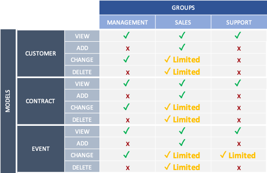

<div id="top"></div>

<!-- PROJECT SHIELDS -->
<!--
*** I'm using markdown "reference style" links for readability.
*** Reference links are enclosed in brackets [ ] instead of parentheses ( ).
*** See the bottom of this document for the declaration of the reference variables
*** for contributors-url, forks-url, etc. This is an optional, concise syntax you may use.
*** https://www.markdownguide.org/basic-syntax/#reference-style-links
-->
[![oc][oc-project-shield]][oc-project-url]
[![rest-api][rest-api-shield]][rest-api-url]
[![django-rest-framework][django-rest-framework-shield]][django-rest-framework-url]
[![endpoints][endpoints-shield]][endpoints-url]
[![permissions][permissions-shield]][permissions-url]
[![postman][postman-shield]][postman-url]
[![postgresql][postgresql-shield]][postgresql-url]
[![logging][logging-shield]][logging-url]

<!-- PROJECT LOGO -->
<br />
<div align="center">

<h1 align="center">OC - PROJECT N°12 - CRM Platform using Django ORM Back-end </h1>

  <p align="center">
   Epic Events is a CRM App used internally to handle customers info, contracts and events.
    <br />
</p>
</div>

<a href="https://images.unsplash.com/photo-1508997449629-303059a039c0?ixlib=rb-4.0.3&ixid=MnwxMjA3fDB8MHxwaG90by1wYWdlfHx8fGVufDB8fHx8&auto=format&fit=crop&w=1770&q=80"><small>By Britt Gaiser</small></a>


<!-- ABOUT THE PROJECT -->
## Project Overview


## Entity-Relationship Diagram


## Endpoints Summary


## Groups Permissions

#### Example
Customer Model for Change Action :
- Management group can change any customer information
- Sales group can change only customer information that has been assigned to them
- Support group can't change customer information


<p align="right">(<a href="#top">back to top</a>)</p>


## Built With

* Python 
* Django Rest Framework
* PostgreSQL
* Postman

<p align="right">(<a href="#top">back to top</a>)</p>


<!-- GETTING STARTED -->
## Getting Started

### Installation & Running the script

1. Clone the repo
   ```sh
   git clone https://github.com/Jliezed/oc_project_12_epicevents.git
   ```

### Create and activate a virtual environment
2. Install venv library (if not yet in your computer)
   ```sh
   pip install venv
   ```
3. Create a virtual environment
   ```sh
   python -m venv env
   ```
4. Activate the virtual environment
   ```sh
   source env/bin/activate
   ```
#### Install packages
6. Install the packages using requirements.txt
   ```sh
   pip install -r requirements.txt
   ```
#### Set environment variables
7. Create a copy of the file ".env.default" and rename it ".env"
8. Set value to the .env file:
   1. Define a secret key
   2. Debug to True for local development or False for production
   3. Allowed host equal to 127.0.0.1 for local environment

      ```sh
      SECRET_KEY='YOUR SECRET KEY'
      DEBUG=True
      ALLOWED_HOSTS=['127.0.0.1']
      ```
   4. Setup the database information
      ```sh
      DATABASE_NAME="YOUR_DATABASE_NAME"
      DATABASE_USER="YOUR_DATABASE_USER"
      DATABASE_PASSWORD="YOUR_DATABASE_PASSWORD"
      DATABASE_HOST="YOUR_DATABASE_HOST"
      DATABASE_PORT="5432"
      ```
      
#### Access to the App
9. Run the server
   ```sh
   python manage.py runserver
   ```
10. create a superuser
    ```sh
    python manage.py createsuperuser
    ```
11. Log to the API: http://127.0.0.1:8000/api/auth/login/
    ```sh
    User: your_username
    Password: your_password
    ```
### Access the different endpoints
- http://127.0.0.1:8000/api/customers/
- http://127.0.0.1:8000/api/customers/1
- http://127.0.0.1:8000/api/customers/1/contracts/
- http://127.0.0.1:8000/api/customers/1/contracts/
- http://127.0.0.1:8000/api/customers/1/contracts/1
- http://127.0.0.1:8000/api/customers/1/contracts/1/events/
- http://127.0.0.1:8000/api/customers/1/contracts/1/events/1
---


<p align="right">(<a href="#top">back to top</a>)</p>


<!-- MARKDOWN LINKS & IMAGES -->
<!-- https://www.markdownguide.org/basic-syntax/#reference-style-links -->
[oc-project-shield]: https://img.shields.io/badge/OPENCLASSROOMS-PROJECT-blueviolet?style=for-the-badge
[oc-project-url]: https://openclassrooms.com/fr/paths/518-developpeur-dapplication-python

[rest-api-shield]: https://img.shields.io/badge/-REST%20API-blue?style=for-the-badge
[rest-api-url]: https://en.wikipedia.org/wiki/Representational_state_transfer

[django-rest-framework-shield]: https://img.shields.io/badge/-Django%20Rest%20Framework-blue?style=for-the-badge
[django-rest-framework-url]: https://www.django-rest-framework.org/

[endpoints-shield]: https://img.shields.io/badge/-ENDPOINTS-blue?style=for-the-badge
[endpoints-url]: https://kinsta.com/knowledgebase/api-endpoint/

[postman-shield]: https://img.shields.io/badge/-POSTMAN-blue?style=for-the-badge
[postman-url]: https://www.postman.com/

[permissions-shield]: https://img.shields.io/badge/-PERMISSIONS-blue?style=for-the-badge
[permissions-url]: https://www.django-rest-framework.org/api-guide/permissions/

[postgresql-shield]: https://img.shields.io/badge/-POSTGRESQL-blue?style=for-the-badge
[postgresql-url]: https://www.postgresql.org/

[logging-shield]: https://img.shields.io/badge/-LOGGING-blue?style=for-the-badge
[logging-url]: https://docs.python.org/3/howto/logging.html